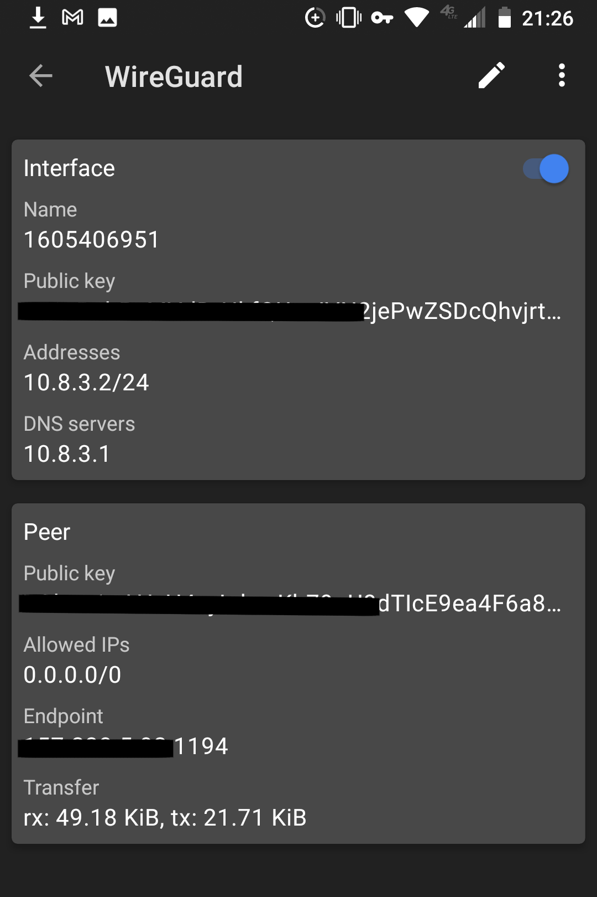

# The VPN
A crowd configured, security-focused, free and open source VPN solution.

### Overview
Trust is earned, not turned on by default.
3rd part VPN providers today may claim to not keep any trace of your data and activities
but there is no way to know for sure.
For security reasons most servers are monitoried for suspcicious login activity and potential cyber attacks.
Law enforcement use warrants to gain access to VPN providers servers as the police survallience state grows.
Many individuals feel that since they are doing nothing illegal, they have nothing to hide.
This may be true but they have everything to lose.
Data in the wrong hands can have adverse consequences with huge impacts, even when the collection and utilization of it is subtle.
Voter fraud and the promotion of false information during important election cycles is evidence of this.
Advertisers attempt to control the desires of consumers and data is in large part used to segment users and distribute propoganda.
Cyber criminals can comprimise open wifi networks and steal your private banking and health information.
Privacy is an essential component of liberty.
Don't give away your data for free.
Protect yourself and others.


Virtual Private Networks, or VPNs, are network devices that provide basic protection from wifi network attacks
and hide information about you, such as your exact location, from prying eyes.
If you are using a public wifi network you should ALWAYS use a VPN.
You can also gain access to geographically restricted content as VPNs make it appear you are browsing the internet from another location.

This location is determined by where the VPN service is hosted.
The rise of cloud computing in recent years makes deploying computer services in data centers around the world.
Today these datacenter providers are currently larger scale enterprises such as Amazon Web Services, Microsoft Azure, Google Cloud Platform, Digitial Ocean, etc.
As these cloud providers monitor these servers for security and performance reasons it does not hide your illegal activity.
You should not do illegal things.
Work with your local governments to create the change you want to see in the world.
Although you are not completely hidden behind a VPN hosted on a enterprise cloud provider, you are protected from local area network attacks on unprotected public wifi networks and
free to bypass censorship in authoritarian regions of the world.
Eventually we will support easily deploying a VPN on your home network.

The VPN provides an easy way to deploy VPN servers that you control with the cloud provider you trust.
This repo contains scripts to configure the servers required in a secure fashion as we are constantly updating it with the best recommended security practices.
So you can feel secure without having to neccesarily understand the inner workers of how the service is configured.
Although since this is a FOSS project you are free to audit the code and study it as you wish.
Contributions always welcome!


The infrastructure for deploying the VPN is also open source as it leverages Terraform for provisioning the servers and Wireguard as the VPN service itself.
This project is of course targeted at support mainly for Linux servers as well.


### Supported Cloud Providers
```
[x] Digital Ocean
[] Amazon Web Services
[] Google Cloud Platform
[] Microsoft Azure

[] Host your own at home
```

### Prerequisites
* Terraform
* Supported Cloud Provider API Key
* Local SSH key


### Installation
Install terraform for your machine according to the documentation

Generate SSH key for the project
`ssh-keygen`

Call the key what you would like, in this example `id_rsa_terraform_vpn`.
and leave the passphrase empty for now.

Add the following to `.bash_profile`

```
export TF_VAR_DO="<DO_API_KEY>"
export TF_VAR_PRIVATE_VPN="<path_to_key>/id_rsa_terraform_vpn"
export TF_VAR_PUBLIC_VPN="<path_to_key>/id_rsa_terraform_vpn.pub"

export ADMIN_EMAIL=<your_email_address>
```

where 

`<DO_API_KEY>` is your Digital Ocean API key.\
`<path_to_key>` is the absolute path to the ssh keys created on your system.\
`<your_email_address>` is an email account you have access to.


And then run `source ~/.bash_profile` to enable the changes.

You can then run `terraform init`, `terraform plan`, `terraform apply` to build each server.

To take down the VPN server run `terraform destroy`.


### Wireguard Client
Once the VPN server is deployed you will have received your client configuration file via email.
You will need to download a Wireguard VPN client from your devices app store onto your device.


[WireGuard Installation](https://www.wireguard.com/install/)

You can then import your VPN configuration into the app and connect your device to the VPN.

WireGuard Setup.  Select the `+` button to import a new configuration.


Select to "Import From File or Archive"


Select the `.conf` file received by email once the VPN server has completed its installation.
Once loaded in the VPN instance will be listed in the WireGuard client.


You can now toggle the VPN on and off to access your secure network.
It is also possible to see the VPN details and change the name to something more human readable.




### Adding new vpn clients
You can create new VPN keys for additional clients by running the following command

`ssh root@MachineB 'bash -s' < vpn-add-client.sh`

### Changing the VPN region
Before running the terraform commands you can change the digitalocean.tf file and update it to a different deployment region.

In the droplet section change the region to any supported DO slug.
```
region             = "nyc1"
```

Example DO regions
```
New York City: "nyc1"
Amsterdam: "ams3"
San Francisco: "sfo3"
Singapore: "sgp1"
London: "lon1"
Frankfurt: "fra1"
Toronto: "tor1"
Bangalore: "blr1"
```

